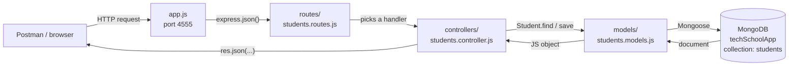
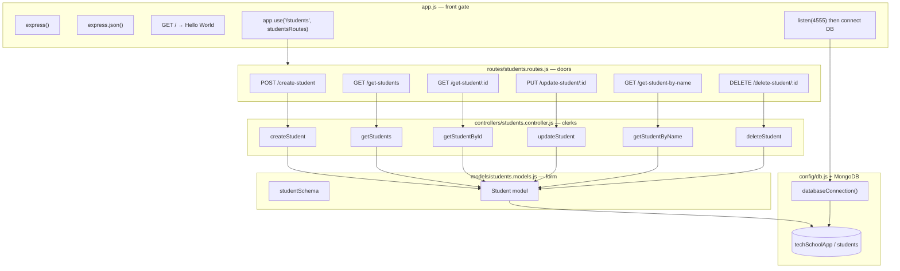

# How the Student API is put together

We took one fat `app.js` and split it into **layers**. Each layer has one job. A request walks through them like a school office: reception → clerk → filing cabinet.

```
  BEFORE                              AFTER
  ──────                              ─────

  ┌─────────────────┐                 ┌─────────────────┐
  │     app.js      │                 │     app.js      │  start the school
  │  (everything)   │                 │  + express.json │
  │                 │                 │  + mount routes │
  │  connect DB     │                 └────────┬────────┘
  │  schema         │                          │
  │  all routes     │                          ▼
  │  all logic      │                 ┌─────────────────┐
  └─────────────────┘                 │     routes      │  the menu of doors
                                      └────────┬────────┘
                                               │
                                               ▼
                                      ┌─────────────────┐
                                      │   controllers   │  the work happens here
                                      └────────┬────────┘
                                               │
                                               ▼
                                      ┌─────────────────┐
                                      │     models      │  the student form
                                      └────────┬────────┘
                                               │
                                               ▼
                                      ┌─────────────────┐
                                      │   config/db     │  the cupboard key
                                      └─────────────────┘
```

---

## 1. A request walking through the building



**In words:** the client never talks to MongoDB. It talks to Express. Express asks the router which door was knocked. The router calls a controller function. The controller uses the Student model. The model talks to MongoDB. The answer travels back the same way.

---

## 2. What each file is for

```
techySchoolApp/
│
├── app.js                         ← front gate
│                                    creates Express, teaches it JSON,
│                                    hangs the students router on /students,
│                                    opens classroom 4555
│
├── config/
│   └── db.js                      ← cupboard key
│                                    mongoose.connect(
│                                      mongodb://localhost:27017/techSchoolApp
│                                    )
│
├── models/
│   └── students.models.js         ← the form every student must fill
│                                    name, age, email, phone,
│                                    address, course, institution
│                                    mongoose.model("Student", ...)
│                                    → real collection name: "students"
│
├── controllers/
│   └── students.controller.js     ← the clerk who does the work
│                                    create / list / find / update / delete
│
└── routes/
    └── students.routes.js         ← the list of doors
                                     maps URL + method → controller function
```



---

## 3. The doors (full URLs)

Because the router is mounted at `/students`, every path below is prefixed.

```
  Client                         Method   Full URL                         Clerk
  ──────                         ──────   ────────                         ─────
  "add a student"                POST     /students/create-student         createStudent
  "show everybody"               GET      /students/get-students           getStudents
  "show this one id"             GET      /students/get-student/:id        getStudentById
  "change this one"              PUT      /students/update-student/:id     updateStudent
  "find by exact name"           GET      /students/get-student-by-name    getStudentByName
  "remove this one"              DELETE   /students/delete-student/:id     deleteStudent
  "is the school open?"          GET      /                                Hello World
```

```
                    ┌──────────────────────────────────────────┐
                    │              app.js  :4555               │
                    │                                          │
                    │   GET /          →  "Hello World"        │
                    │                                          │
                    │   /students  ──►  students.routes.js     │
                    │                   ┌────────────────────┐ │
                    │                   │ POST   /create-... │ │
                    │                   │ GET    /get-students│ │
                    │                   │ GET    /get-student/│ │
                    │                   │ PUT    /update-... │ │
                    │                   │ GET    /get-...name│ │
                    │                   │ DELETE /delete-... │ │
                    │                   └─────────┬──────────┘ │
                    └─────────────────────────────┼────────────┘
                                                  │
                                                  ▼
                    ┌──────────────────────────────────────────┐
                    │         students.controller.js           │
                    │                                          │
                    │   unpack req.body / req.params / query   │
                    │   call Student.save / find / update      │
                    │   send res.status(...).json(...)         │
                    └─────────────────────┬────────────────────┘
                                          │
                                          ▼
                    ┌──────────────────────────────────────────┐
                    │          students.models.js              │
                    │                                          │
                    │   Schema  →  model name "Student"        │
                    │           →  collection  "students"      │
                    └─────────────────────┬────────────────────┘
                                          │
                                          ▼
                    ┌──────────────────────────────────────────┐
                    │     MongoDB  localhost:27017             │
                    │     database: techSchoolApp              │
                    │     collection: students                 │
                    └──────────────────────────────────────────┘
```

---

## 4. One example, step by step

**Admin creates Ada** — `POST /students/create-student`

```
  Postman
     │  JSON body: { name, age, email, ... }
     │  header: Content-Type: application/json
     ▼
  app.js
     │  express.json() turns the text into req.body
     │  path starts with /students → send to the router
     ▼
  students.routes.js
     │  POST /create-student  →  createStudent
     ▼
  students.controller.js
     │  pick name, age, email, ... out of req.body
     │  new Student({ ... })
     │  await student.save()
     ▼
  students.models.js
     │  checks the shape (name is String, age is Number, ...)
     ▼
  MongoDB  (techSchoolApp.students)
     │  writes one document, gives it an _id
     ▼
  back to the controller
     │  res.status(200).json({ message, student })
     ▼
  Postman sees Ada plus her _id
```

---

## 5. Why we split it

| Layer        | File                         | Job                                      | Should not do                          |
|--------------|------------------------------|------------------------------------------|----------------------------------------|
| App          | `app.js`                     | Start server, JSON, mount routers        | Know how to save a student             |
| Routes       | `routes/students.routes.js`  | Map URL + HTTP method to a function      | Talk to MongoDB                        |
| Controllers  | `controllers/...controller.js` | Read the request, call the model, reply | Own the Express app or the schema      |
| Models       | `models/students.models.js`  | Shape of a student + Mongoose model      | Send HTTP responses                    |
| Config       | `config/db.js`               | Connect to MongoDB                       | Define routes                          |

Same idea as a school:

- **app.js** is the front gate and the timetable
- **routes** are the classroom doors
- **controllers** are the teachers doing the work
- **models** are the attendance register (what a student looks like)
- **db.js** is the key to the records cupboard
